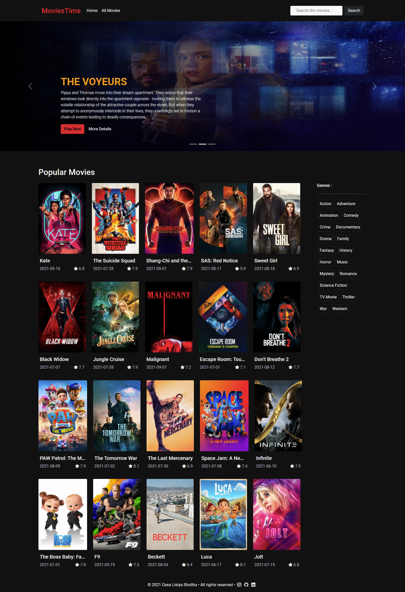

# Movies Time - Submission Dicoding Belajar Fundamental Front-End Web Development

# How to Run the Program

1. Go to the apps folder
2. If the node_modules folder doesn't exist Install the packages in the project dependencies : npm install
3. Run apps : npm run start-dev

# What I did and learn?

1. Introducing
2. ECMAScript 2015 (ES6)
3. Web Component
4. Node Package Manager
5. Webpack
6. JavaScript Asynchronous Request

# Screenshoot

- Instagram - [cesalstys](https://www.instagram.com/cesalstys/)
- Linkedin - [cesalistya](https://www.linkedin.com/in/cesa-listya-sholiha-b6a3091aa/)
